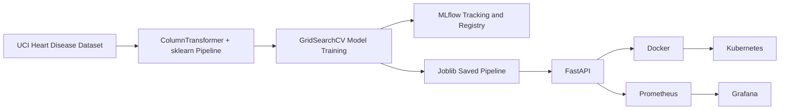

# Heart Disease Prediction using MLOps

An end-to-end, production-oriented MLOps project for binary heart-disease prediction using the UCI Cleveland Heart Disease dataset. It automatically downloads data, produces EDA artifacts, cross-validates four models, tracks runs in MLflow, serves predictions through FastAPI, and supports Docker, Kubernetes, Prometheus, Grafana, and CI.

Repository: [github.com/anshulmandrelia/heart-disease-mlops](https://github.com/anshulmandrelia/heart-disease-mlops)

> Educational use only. This model is not a medical device and must never be used to make clinical decisions.

## Architecture

```text
UCI dataset -> preprocessing pipeline -> GridSearchCV -> MLflow + joblib
                                         |                    |
                                      screenshots          FastAPI
                                                               |
                                                Prometheus -> Grafana
                                                               |
                                                   Docker / Kubernetes
```



## Project layout

```text
api/                 FastAPI prediction service
data/                Automatically downloaded CSV (gitignored)
docker/              Local multi-service Compose configuration
kubernetes/          Deployment, service, and ingress manifests
model/               Persisted joblib model and training summary
monitoring/          Prometheus configuration and Grafana dashboard
notebooks/           Executable EDA and training notebooks
screenshots/         EDA and evaluation charts
src/                 Data, training, evaluation, and prediction modules
tests/               Pytest coverage of API and ML components
```

## Install and train

Prerequisite: Python 3.8 or newer. The Docker image and GitHub Actions workflow use Python 3.11; the pinned dependency set also supports local Python 3.8 development.

```bash
python3 -m venv .venv
source .venv/bin/activate              # Windows: .venv\Scripts\activate
pip install --upgrade pip
pip install -r requirements.txt
python -m src.train
```

The first training run downloads `processed.cleveland.data` from UCI and stores a normalized CSV under `data/`. The target maps UCI values 1–4 to `1` (disease present) and 0 to `0`.

If a restricted network prevents download, place the original Cleveland-format file at `data/heart_disease.csv`. It must have the columns `age, sex, cp, trestbps, chol, fbs, restecg, thalach, exang, oldpeak, slope, ca, thal, target`; use `?` or an empty cell for unknown values. The training workflow will apply the same cleaning and preprocessing.

Training evaluates Logistic Regression, Random Forest, XGBoost, and an RBF Support Vector Machine. Each estimator is fitted inside a `ColumnTransformer` pipeline (median/mode imputation, one-hot encoding, numerical standardization) and tuned with five-fold `GridSearchCV` on ROC-AUC. The best pipeline is written to `model/heart_disease_pipeline.joblib`; plots are written to `screenshots/`.

## MLflow

```bash
mlflow ui --backend-store-uri sqlite:///mlflow.db --port 5000
```

Open `http://localhost:5000`. Training logs hyperparameters, cross-validation scores, holdout metrics, diagnostics, EDA/feature-importance artifacts, the sklearn pipeline, and registers the winning model as `HeartDiseasePredictor`.

## Run the API

Train first, then run:

```bash
uvicorn api.app:app --host 0.0.0.0 --port 8000
```

Interactive Swagger UI is at `http://localhost:8000/docs`. Health and Prometheus endpoints are `/health` and `/metrics`.

```bash
curl -X POST http://localhost:8000/predict \
  -H 'Content-Type: application/json' \
  -d '{"age":63,"sex":1,"cp":3,"trestbps":145,"chol":233,"fbs":1,"restecg":0,"thalach":150,"exang":0,"oldpeak":2.3,"slope":0,"ca":0,"thal":1}'
```

The response includes a binary prediction, readable label, positive-class probability, confidence score, and response latency. `POST /batch_predict` accepts `{ "records": [ ... ] }`, with 1–1,000 records.

Example response:

```json
{
  "prediction": 0,
  "prediction_label": "no_heart_disease",
  "probability": 0.4429,
  "confidence_score": 0.5571,
  "response_time_ms": 41.72
}
```

## Quality checks

```bash
flake8 src api tests
pytest -q
```

## Docker and monitoring

Build after training so the model is included:

```bash
docker build -t heart-disease-mlops:latest .
docker run --rm -p 8000:8000 heart-disease-mlops:latest
docker compose -f docker/docker-compose.yml up --build
```

Compose exposes the API on 8000, Prometheus on 9090, and Grafana on 3000. Import `monitoring/grafana_dashboard.json` into Grafana and configure Prometheus as its datasource.

## Kubernetes

Build and make the image available to the target cluster, then apply all manifests:

```bash
kubectl apply -f kubernetes/deployment.yaml
kubectl apply -f kubernetes/service.yaml
kubectl apply -f kubernetes/ingress.yaml
kubectl rollout status deployment/heart-disease-api
```

Set DNS for `heart-disease.local` to the ingress controller or replace that host with a domain you control. The deployment has two replicas, resource limits, non-root execution, and HTTP health probes.

## Configuration and environment

`config.yaml` centralizes paths, split seed, cross-validation, scoring, and MLflow URI. The serving service honors `MODEL_PATH` and `LOG_LEVEL` environment variables. Structured JSON logs include request IDs, errors, prediction outcome, and latency.

## Assignment evidence

The submission-ready report is available as [DOCX](Heart_Disease_MLOps_Assignment_Report.docx) and [Markdown source](FINAL_REPORT.md). Read [SUBMISSION_GUIDE.md](SUBMISSION_GUIDE.md) for the submission package and student-detail fields. Use [SUBMISSION_EVIDENCE_CHECKLIST.md](SUBMISSION_EVIDENCE_CHECKLIST.md) and [screenshots/README.md](screenshots/README.md) to capture the required authentic UI, MLflow, Docker, Kubernetes, CI, and monitoring evidence. A ready-to-record two-to-three-minute demonstration is provided in [VIDEO_SCRIPT.md](VIDEO_SCRIPT.md). The implementation summary is in [report.md](report.md).
